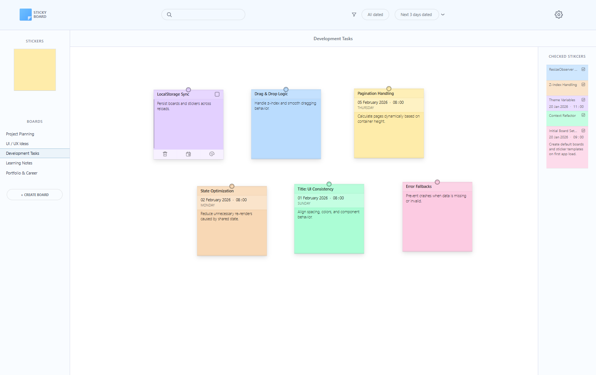
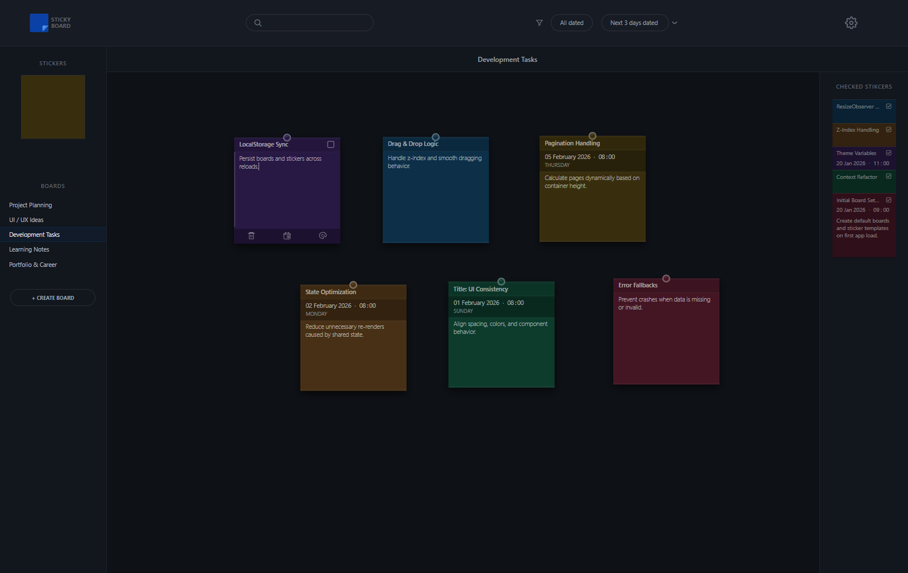
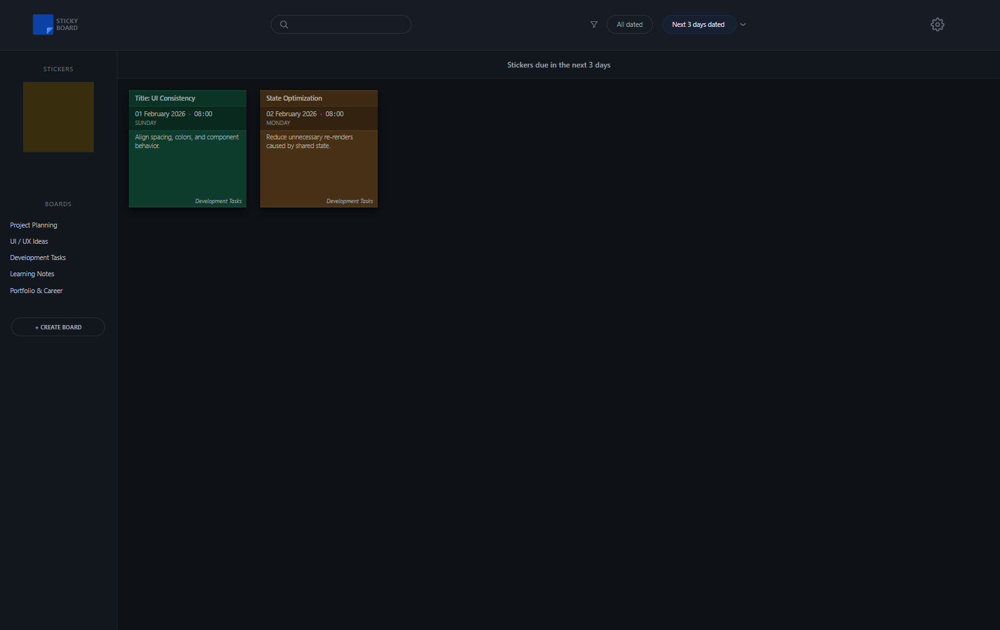
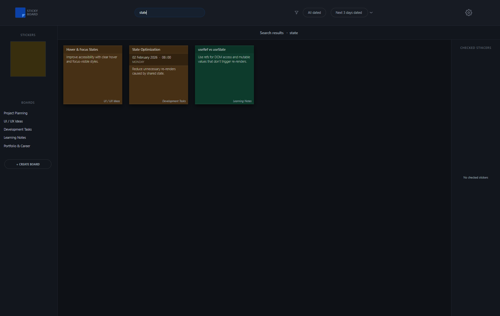

# StickyBoard App

StickyBoard is a React-based sticky notes board application with a strong focus on UI/UX and interactive behavior.

## 🚀 Live Demo
https://srdanbtm.github.io/react-stickyboard-app/

## 📸 Screenshots

### Main Board (Light theme)

### Main Board (Dark theme)

### Filter Panel

### Search Panel

## 🛠️ Tech Stack
- React (Hooks, Context API)
- JavaScript (ES6+)
- CSS Modules
- Framer Motion
- Vite (build tool)
- localStorage

## ✨ Features
- Multiple boards with independent state
- Draggable sticky notes with color customization
- Date & time support with time-based filtering
- Separate panel for completed (checked) notes
- Show / hide completed notes panel with hover interaction
- Light / Dark theme
- Smooth UI animations
